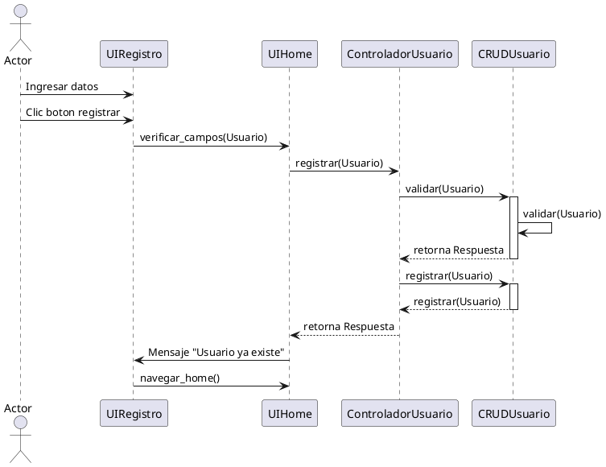

## Preguntas

- Que son las competencias?
- Cuales son los tipos de competencias?
- Que son los valores?

## Apuntes

- Las competencias son las habilidades de una persona, responde a la pregunta "De que eres capaz?".
- Tipos de competencias:
	- Competencias blandas: Son habilidades que desarrollaste durante tu formacion (capacidad de comunicarse asertivamente, capacidad de analisis), cada capacidad suele estar acompaniada de un ejemplo.
		- Competencias tecnicas o duras: Es el conocimiento sobre un cargo o herramienta, es indispensable pero no suele destacar entre los demas ya que todos deberian manejar esa herramienta.
- Los valores son cualidades que te caracterizan como persona (puntualidad, responsabilidad, honestidad). 

## Resumen

En una entrevista laboral suelen preguntarte sobre tus competencias y valores, las competencias es sobre lo que eres capaz. Los valores es lo que define tu comportamiento en la empresa, ya sea puntualidad, respeto, etc. Existen dos tipos de competencias o habilidades: Habilidades blandas (como interactuas con los demas) y tecnicas o duras (conocimientos tecnicos)

